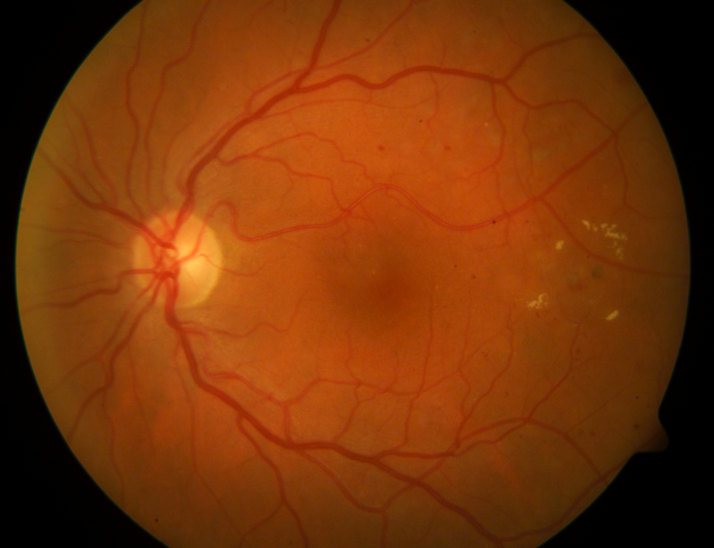
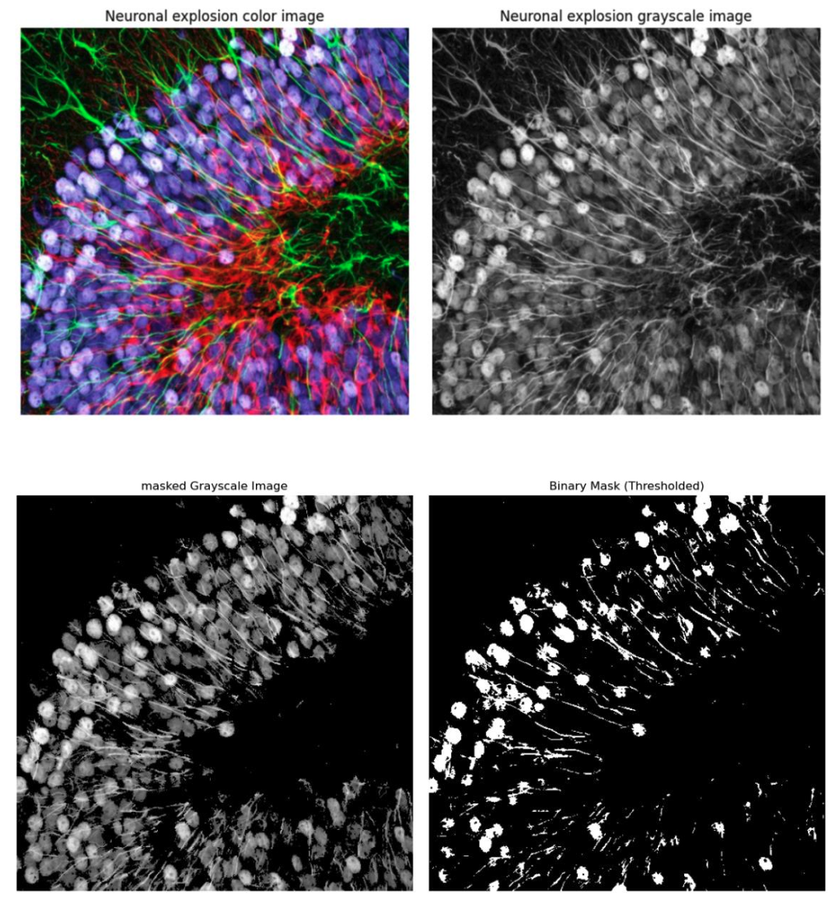
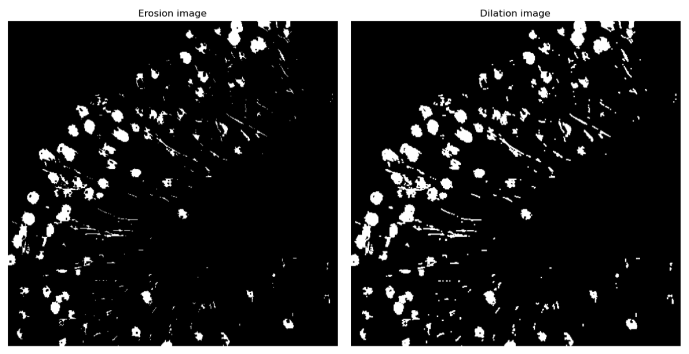
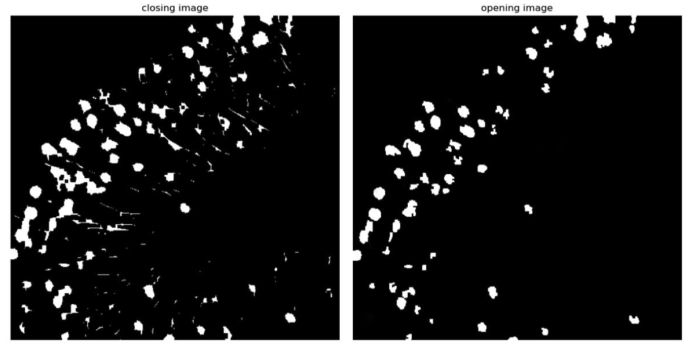
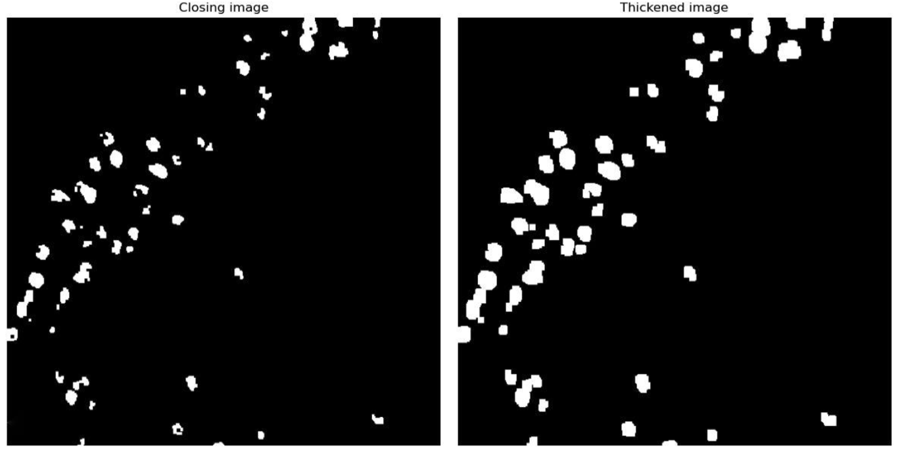
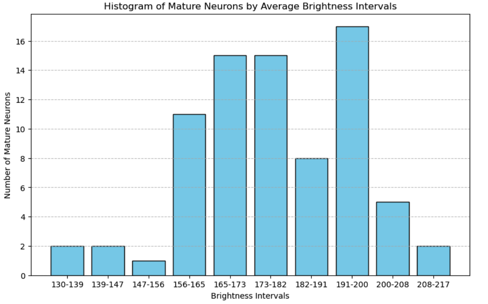
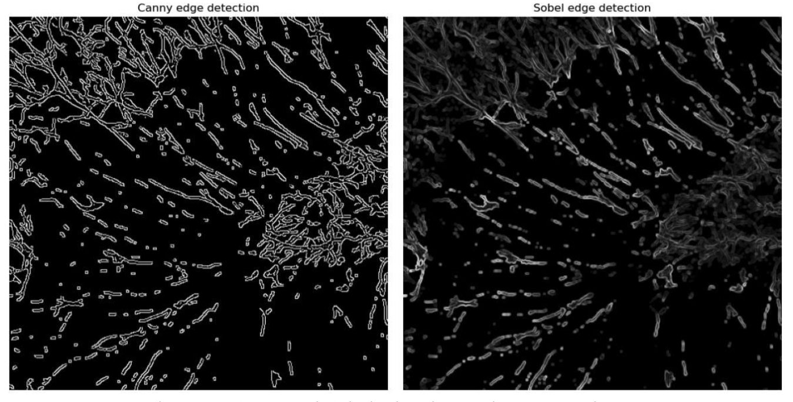
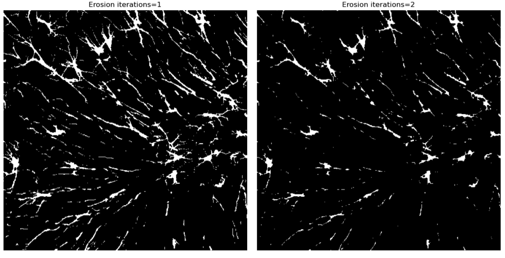
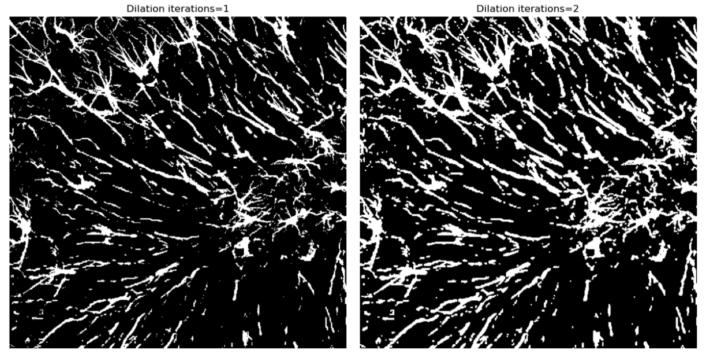

# 🧠 Image Processing for Retinal and Neuronal Images

## 📘 Overview

This project applies classical image processing techniques to biomedical images, particularly:
- **Retinal blood vessel segmentation**
- **Neuronal cell extraction**
- **X-ray CT imaging analysis**

We employ a combination of **OpenCV**, **morphological operations**, **histogram analysis**, and **filtering techniques** to improve segmentation accuracy and clarity.

---

## 🔍 Project Structure

### 🔴 Part 1: Retina Image Masking

📌 **Goal**: Extract the circular retinal region from `retina.png`, removing the black background.

**Techniques Used**:
- Grayscale conversion
- Binary thresholding (`cv2.threshold`)
- Morphological operations:
  - Erosion
  - Dilation
  - Opening (`erosion ➝ dilation`)
  - Closing (`dilation ➝ erosion`)

**Kernel Used**:
```python
kernel = np.ones((3,3), np.uint8)
```

📊 **Mathematical Expressions**:

- **Erosion**:
  ```
  f ⊖ h = { j ∈ ℤ | h: ⊆ f }
  ```

- **Dilation**:
  ```
  f ⊕ h = { j ∈ ℤ | (h: ∩ f ≠ ∅) }
  ```

- **Opening**:
  ```
  f ∘ h = (f ⊖ h) ⊕ h
  ```

- **Closing**:
  ```
  f • h = (f ⊕ h) ⊖ h
  ```

| Original color image Retina |
|--------------------------------------------|
| |

| Original color image converted to grayscale |
|--------------------------------------------|
| |

---

###  Part 2: Retinal Background Normalisation

📌 **Goal**: Reduce uneven illumination across the retina to enhance vascular contrast.

**Filtering Techniques Compared**:
- Gaussian Filter
- Mean Filter
- Median Filter

**Kernel Size**: `99x99` (6.6% width, 8.6% height of image)

📐 **Mathematical Formula**:
```math
I_normalised(x,y) = I_original(x,y) / I_background(x,y)
```

🖼️ **Figures**:
- Background illumination estimate
- Evenly illuminated image (Gaussian best)

---

### 🩸 Part 3: Retinal Vessel Segmentation

📌 **Goal**: Segment blood vessels using edge detection methods.

**Pipeline**:
1. Green channel extraction
2. CLAHE
3. Non-local means denoising
4. Morphological masking

**Edge Detection Methods**:
- **Canny**:
  - Thresholds: 25 & 10
  - Good for sharp edges
- **Sobel + Otsu**:
  - Auto-thresholding using inter-class variance minimization
- **Laplacian of Gaussian (LoG)**:
  - 2nd derivative + smoothing

📐 **Canny Gradient Formula**:
```math
G = √(G_x² + G_y²)
```

📐 **Otsu Thresholding**:
```math
σ²_B(t) = w₀(t)σ²₀(t) + w₁(t)σ²₁(t)
```

🖼️ **Figures**:
- Canny edge detection
- Sobel and LoG segmentation
- Morphologically refined vessel maps

---

### ⚙️ Part 4: XCT Physics & Segmentation

📌 **Goal**: Analyse quality factors for blood vessel segmentation from XCT scans.

**Key Concepts**:
- **Beer-Lambert Law**:
  ```math
  I = I₀ * e^{-μx}
  ```
- **Hounsfield Unit (HU)**:
  ```math
  HU = 1000 * (μ - μ_(water)) / μ_(water)
  ```

🧪 **Artifacts & Issues**:
- Beam hardening
- Compton scattering
- Motion artefacts
- Partial volume effect

📈 **Solution Strategy**:
- Adequate photon count
- Use of iodine contrast
- Denoising and high-res projections

---

## 🧪 Methodology

### 1. Grayscale Conversion & Thresholding

- Converted color image to **grayscale** to simplify intensity analysis.
- Applied **global thresholding** (160–255) to isolate mature neurons.

```python
# Binary thresholding logic
if pixel_intensity >= 160:
    pixel = 255  # Foreground
else:
    pixel = 0    # Background
```
### 

| Original color image and grayscale image of neuronal explosion |
|--------------------------------------------|
| |

---

### 2. Morphological Operations

Used to refine the binary mask and improve segmentation accuracy.

| Operation        | Kernel Size | Iterations | Purpose                                     |
|------------------|-------------|------------|---------------------------------------------|
| Erosion          | (2,2)       | 2          | Remove astrocytes (thin lines)              |
| Dilation         | (3,3)       | 1          | Fill gaps in neuron bodies                  |
| Closing          | (3,3)       | 1          | Close small holes in segmented neurons      |
| Opening          | (2,2)       | 1          | Remove small noise and separate connections |
| Final Dilation   | (5,5)       | 1          | Reinforce and reconnect fragmented neurons  |

**📸 Figure 3:** After Erosion and Dilation  


**📸 Figure 4:** After Closing and Opening  


**📸 Figure 5:** Final refined neuron mask  


---

### 3. Brightness Analysis

- Contours of mature neurons were identified using `cv2.findContours()`.
- For each region, the mean brightness (intensity) was calculated using `cv2.mean()`.

```python
# Compute average brightness inside a contour mask
mean_val = cv2.mean(gray_image, mask=contour_mask)[0]
```

- The brightness values were grouped into 10 bins and plotted using `np.histogram()`.

**📸 Figure 6:** Histogram of average brightness in neurons  


🔍 **Observation**:  
Most neurons had an average brightness of **190–200**, which aligns with the visual maturity indicators (brighter = more mature neurons).

---

### 4. Edge Detection

For **astrocyte extraction**, two edge detection methods were applied:

#### Sobel Edge Detection
- Calculates gradient in X and Y directions.
- Quick but sensitive to noise and discontinuities.

#### Canny Edge Detection
- Multi-stage process including Gaussian blur, gradient, and hysteresis.
- More robust, generates smoother continuous edges.

**📸 Figure 7:** Sobel and Canny edge-detected astrocyte image  


After edge detection, morphological operations were applied:

- **Kernel Size:** (2,2) to preserve thin astrocyte structures.
- **Erosion and Dilation**: Used different iterations to test effects on feature clarity.

**📸 Figure 8:** Astrocyte image after Erosion  


**📸 Figure 9:** Astrocyte image after Dilation  


---

## 📊 Results & Visualizations

- **Mature neurons** were clearly segmented using grayscale + morphological ops.
- **Brightness histogram** validated neuron maturity level assumptions.
- **Astrocyte detection** was limited by:
  - Low image resolution
  - Very thin features
  - Kernel size constraints


## 🧰 Tools & Libraries

- **Python 3.9+**
- **OpenCV**
- **NumPy**
- **Matplotlib**

---

## 📊 Results Summary

| Task                         | Best Method             | Notes |
|-----------------------------|--------------------------|-------|
| Retina Masking              | Threshold + Morphology  | Clean circle extraction |
| Illumination Normalisation  | Gaussian Filter         | Best balance of detail |
| Vessel Segmentation         | LoG + CLAHE + Otsu      | Preserves fine vessels |
| Neuron Detection            | Global Threshold + Morph | Accurate segmentation |
| Astrocyte Segmentation      | Canny + Morphology      | Limited by resolution |

---

## 📌 Future Work

- Try Deep Learning models (e.g., U-Net, Mask R-CNN)
- Improve astrocyte detection with adaptive filtering
- Apply active contour models for vessel refinement

---

